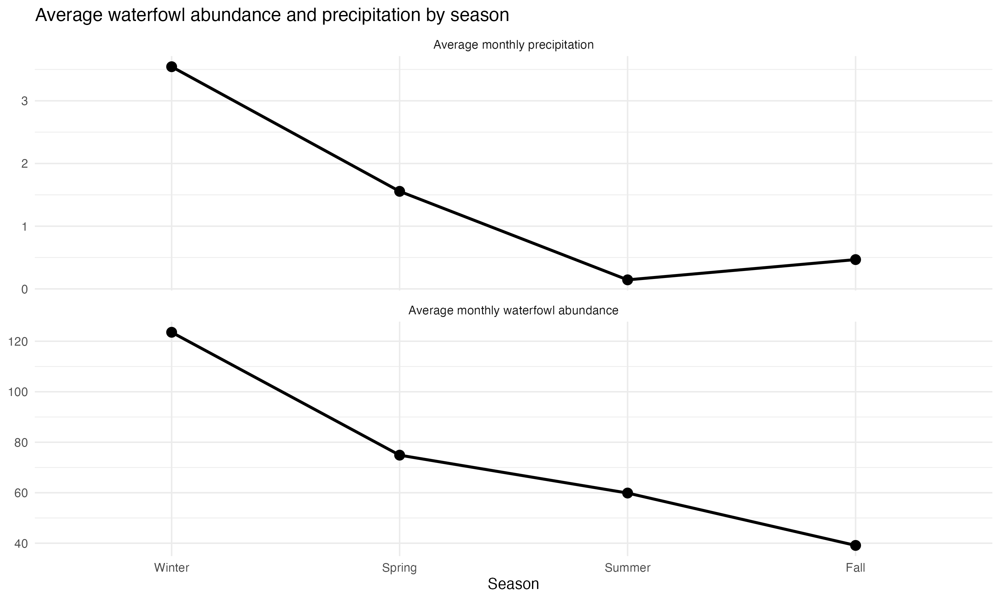

# Group project proposal

**Spring 2026**

Directions:

- Use your work plan from class to fill in the information below.
- Practice pulling, making changes, staging/committing/pulling/pushing to the same repo.
- **Communicate about who is doing what throughout the entire process.**

What you will submit on Friday the 15th:

- proposal: a link to your forked repository with the completed proposal in the README
- work plan: your paper plan that you completed in class on Monday the 4th

Use your project proposal to:

- refer back to the original plan while you are working
- keep track of high-level changes in structure (e.g. role switching, elective modifications)

Note:

- your project proposal is subject to change after you learn more about your datasets and what is possible - allow yourselves the flexibility to make adjustments as needed
- the more detail you can provide in your proposal, the more thorough your feedback will be

## Group members

Sofia Favela, Nina Cutner, Kelsey Hammond

## Group name (optional): 

The Geese 

## Topic information and question

**Topic: Bird abundance and precipitation patterns at North Campus Open Space (NCOS)

**Question(s):**  

- What are the effects of precipitation on bird abundance?
- How does precipitation influence waterfowl abundance through time at NCOS?
- Are there seasonal patterns between precipitation and waterfowl abundance?.

**Response variable(s)**

- Waterfowl abundance
- Species abundance counts
- Seasonal abundance trends

## Datasets

- birds.csv
- NOAA_daily_summaries.csv

## Figures

**Potential figure 1:**

Monthly precipitation through time.

**Potential figure 2:**

Monthly waterfowl abundance through time by species.

**Potential figure 3:**

Relationship between previous month's precipitation and total monthly waterfowl abundance.

**Potential figure 4**

Seasonal comparing abundance and precipitation trends 

## Data cleaning/wrangling/summarizing plan

- Clean column names using `janitor::clean_names()`
- Filter bird data to only include waterfowl observations
- Remove repeat observations and incomplete records
- Convert dates using `lubridate`
- Aggregate bird abundance by month, season, and year
- Join precipitation and bird data sets by date
- Create summarized data sets for seasonal and long-term trend analysis
- Create lagged precipitation variables to compare delayed ecological responses

## Project roles

**Natural history/framing director:**

Kselsey Hammond

**Stats and visualization director**

Nina Cutner

**GitHub/code director**

Sofia Favela 

## Elective (not required for all groups or group members)

**Group members completing elective:**

Kelsey, Nina, and Sofia

**Elective idea:**

Create a digital interpretive trail sign/informational pamphlet on Canva to display to potential trail visitors when the best time of year would be to see waterfowl.

**Elective timeline (what you will have completed each week):**

Week 7: enter your own text here

Week 8 (timeline check in): enter your own text here

Week 9: enter your own text here

Week 10: enter your own text here

Finals week: Submit elective.    

