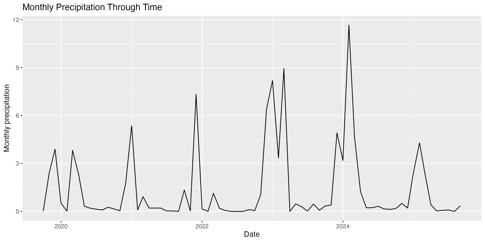
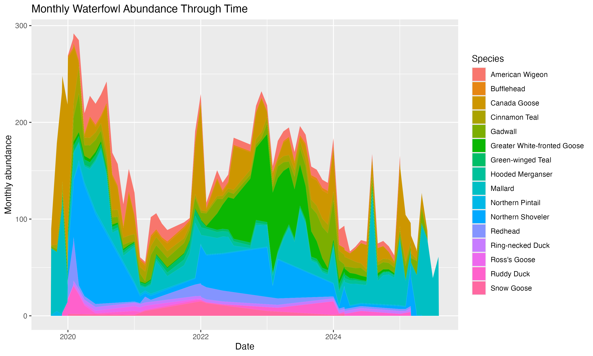
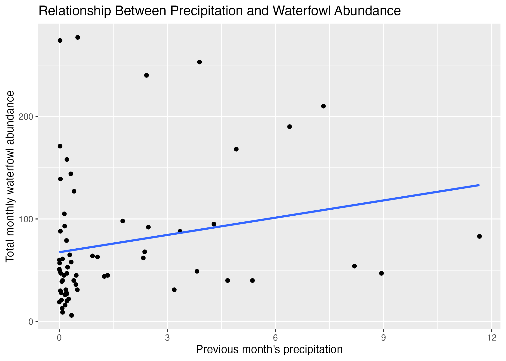

# Group project proposal

**Spring 2026**

Directions:

- Use your work plan from class to fill in the information below.
- Practice pulling, making changes, staging/committing/pulling/pushing to the same repo.
- **Communicate about who is doing what throughout the entire process.**

What you will submit on Friday the 15th:

- proposal: a link to your forked repository with the completed proposal in the README
- work plan: your paper plan that you completed in class on Monday the 4th

Use your project proposal to:

- refer back to the original plan while you are working
- keep track of high-level changes in structure (e.g. role switching, elective modifications)

Note:

- your project proposal is subject to change after you learn more about your datasets and what is possible - allow yourselves the flexibility to make adjustments as needed
- the more detail you can provide in your proposal, the more thorough your feedback will be

## Group members

Sofia Favela, Kelsey Hammond, Nina Cutner
## Group name (optional): 
The Geese 

## Topic information and question

**Topic: Bird Abundnace and Precipitation 

**Question(s):**  

 What are the effects of precipitation on bird abundance (waterfowl)? .

**Response variable(s)**

- waterfowl abundance

## Datasets

- birds.csv
- NOAA_daily_summaries_USW00053152_full_2025-12-09.csv

## Figures

**Potential figure 1:**

- monthly precipitation through time
- line graph (time series)

**Potential figure 2:**

 
- monthly waterfowl abundance through time by species
- stacked area chart

**Potential figure 3:**

- relationship between previous month's precipitation and total monthly waterfowl abundance
- scatter plot with trend line

## Data cleaning/wrangling/summarizing plan

For birds.csv:
- filter to only include 'waterfowl' e_bird_group
- filter for 'no' repeat observations
- filter to only include water years 2020-2025

For NOAA_daily_summaries.csv:
- filter to only include obs from water years 2020-2025
- calculate total monthly precipitation

Must be joined together by date.

## Project roles

**Natural history/framing director:**

Kelsey Hammond

**Stats and visualization director**

Nina Cutner

**GitHub/code director**

Sofia Favela 

## Elective (not required for all groups or group members)

**Group members completing elective:**

Kelsey Hammond, Sofia Favela, Nina Cutner

**Elective idea:**

Create a physical collage using different materials (photos, magazine cut-outs,
feathers, etc) representing waterfowl at NCOS and the effects of precipitation

**Elective timeline (what you will have completed each week):**

Week 7: Gather materials and take photographs at NCOS

Week 8 (timeline check in): Continue to gather materials for collage.

Week 9: Have rough draft/outline completed.

Week 10: Assemble collage, must be done by end of week 10.

Finals week: Submit elective.    

