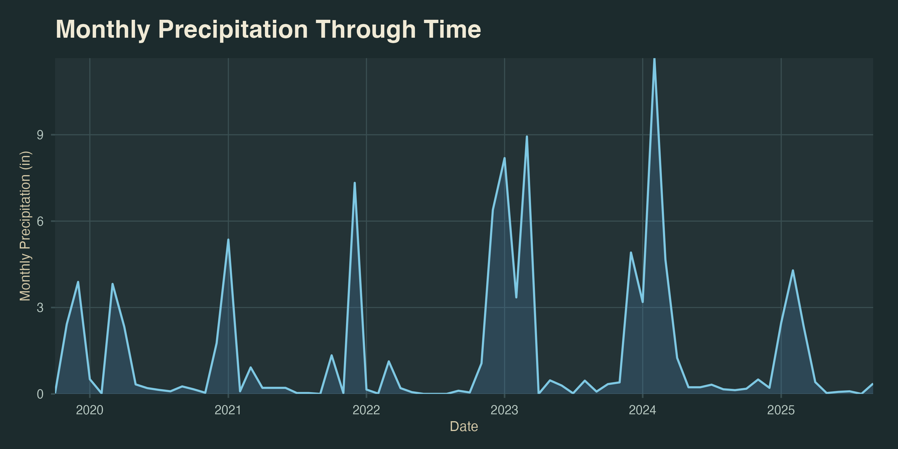
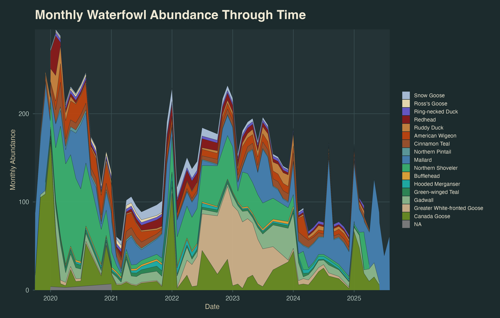
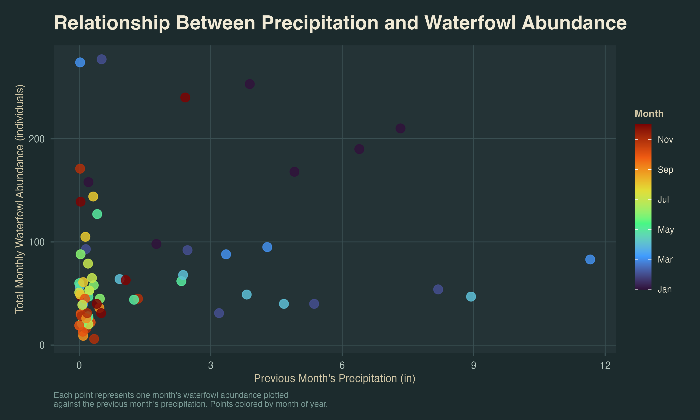
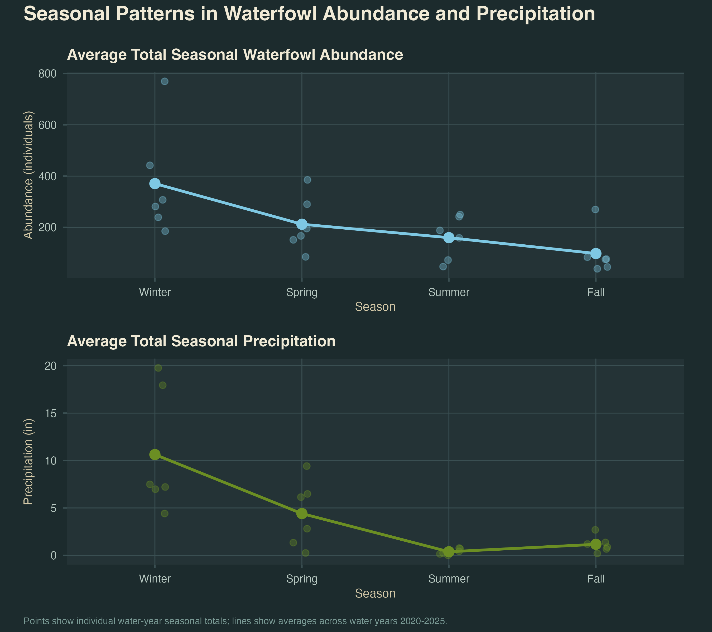

```{r}
#| label: packages

# data wrangling and visualization
library(tidyverse)

# allows file paths to work across computers
library(here)

# formatting axis labels
library(scales)

# working with dates
library(lubridate)
```

```{r}
#| label: data

# read in bird survey data
birds <- read.csv(here("data", "birds.csv"))

# read in NOAA weather data
weather <- read.csv(here("data", "NOAA_daily_summaries.csv"))
```

# Ideas for analysis and background

## Citations

- **Habitat quality and drought effects on breeding mallard and other waterfowl populations in California, USA** [@kahara2021]: This report shows how drought impacts habitat quality which in turn impacts waterfowl population. This is relevant to our study because we are looking at how precipitation impacts waterfowl abundance. Precipitation is a factor for drought.

- **Forecasting waterfowl population dynamics under climate change – Does the spatial variation of density dependence and environmental effects matter?** [@zhao2016]: This report found that due to climate change, Mallard density is predicted to decline. One of the climate variables they examine is precipitation. This is relevant to our study because we are looking at the effects of precipitation on waterfowl. Their modelling is similar to what we are retroactively looking at.

- **The effect of climate change on optimal wetlands and waterfowl management in Western Canada** [@withey2011]: This paper is relevant to our study because they are focusing on how climate change variables such as precipitation and temperature changes will affect wetland habitats. This is where waterbirds live and precipitation affects the quality of the habitat.

- **Trends in abundance of wintering waterbirds relative to rainfall patterns at a central California estuary, 1972-2015** [@stenzel2011]: This paper finds that there is a relationship between waterbirds and rainfall. They find that there is typically a negative relationship between the two, and that the relationship is stronger when looking at rainfall in the current year than in previous years. This is relevant to our study because we are looking at the relationship between waterfowl abundance and precipitation as well.

## Preliminary code for analyses
# Cleaning Data

```{r}
#| label: cleaning-birds

birds_clean <- birds |> 
  # convert observation date to date format
  mutate(
    observation_date = ymd(observation_date),
    
    # create monthly grouping variable
    month = floor_date(observation_date,
                       unit = "month")
  ) |> 
  
  # filter to only include waterfowl observations
  filter(
    e_bird_group == "Waterfowl",
    
    # remove repeat observations
    repeat_observation == "No",
    
    # keep observations within study period
    observation_date > ymd("2019-09-30"),
    observation_date < ymd("2025-10-01")
  )
```

```{r}
#| label: cleaning-weather

weather_clean <- weather |> 
  
  # convert date column to date format
  mutate(
    DATE = ymd(DATE),
    
    # create monthly grouping variable
    month = floor_date(DATE,
                       unit = "month")
  ) |> 
  
  # filter to study period
  filter(
    DATE > ymd("2019-09-30"),
    DATE < ymd("2025-10-01")
  )
```

```{r}
#| label: joining-data-frames

# join bird and weather data by exact date
bird_weather <- full_join(
  x = birds_clean,
  y = weather_clean,
  
  # match bird observation dates to weather dates
  by = c("observation_date" = "DATE")
) |> 
  
  # keep only variables of interest
  select(
    observation_date,
    season,
    species,
    count,
    PRCP
  )
```

# Summaries

```{r}
#| label: monthly-precipitation

# calculate total monthly precipitation
monthly_precip <- weather_clean |> 
  
  # group observations by month
  group_by(month) |> 
  
  # sum precipitation within each month
  summarize(
    monthly_prcp = sum(PRCP, na.rm = TRUE),
    
    # remove grouping after summarizing
    .groups = "drop"
  )
```

```{r}
#| label: monthly-waterfowl-abundance

# calculate monthly abundance by species
monthly_waterfowl <- birds_clean |> 
  
  # group by month and species
  group_by(month, species) |> 
  
  # sum bird counts within each month
  summarize(
    abundance = sum(count, na.rm = TRUE),
    
    # remove grouping after summarizing
    .groups = "drop"
  )
```

```{r}
#| label: total-monthly-waterfowl

# calculate total monthly waterfowl abundance
total_monthly_waterfowl <- birds_clean |> 
  
  # group by month
  group_by(month) |> 
  
  # sum all bird counts within each month
  summarize(
    total_abundance = sum(count, na.rm = TRUE),
    
    # remove grouping after summarizing
    .groups = "drop"
  )
```

# Joining data

```{r}
#| label: joining-monthly-data

# join monthly bird abundance with monthly precipitation
bird_weather_monthly <- total_monthly_waterfowl |> 
  
  # join by month
  left_join(monthly_precip,
            by = "month") |> 
  
  # arrange chronologically
  arrange(month) |> 
  
  # create lagged precipitation variable
  mutate(
    
    # previous month's precipitation
    lagged_prcp = lag(monthly_prcp)
  )
```

# Visualizations directly relevant to answering questions

# Other exploratory visualizations


## Figure 1: Monthly precipitation through time



Figure 1 depicts monthly precipitation trends at NCOS from water years 2020-2025. This figure lays out context for a potential relationship between precipitation and waterfowl abundance to be compared.

## Figure 2: Monthly waterfowl abundance through time by species

Figure 2 depicts monthly waterfowl abundance trends at NCOS from water years 2020-2025 across all waterfowl species. This figure also provides necessary context in exploring the potential relationship between precipitation and waterfowl abundance. We can begin to see that waterfowl abundance may have a negative relationship with precipitation, for example, 2020 was a relatively dry year, yet shows the highest waterfowl abundance, and 2024 was a relatively wet year, yet shows low waterfowl abundance.

## Figure 3: Lagged precipitation vs. species abundance

Figure 3 depicts the relationship between total monthly waterfowl abundance and the previous months precipitation. A lagged precipitation variable was used in order to show a potential predictive effect. Overall, the figure shows little to no clear trend, allowing us to conclude that there is no prominent effect of precipitation on waterfowl abundance.

# Other exploratory visualizations

## Figure 4: Average seasonal trends comparing waterfowl abundance and precipitation

Figure 4 uses a facet graph to compare average seasonal precipitation and waterfowl abundance across water years 2020-2025. While this graph may at first contradict the previous figures' notions, showing similar trends between the two variables across seasons, we can assume similar seasonal trends for waterfowl and precipitation, although having no direct effect on each other. This figure can be used in our elective interpretive trail sign to show potential trail visitors when the best time of the year to see waterfowl are (it may also just happen to be the wettest times of the year).


# Plan for elective


## Conecpt

We want to create a tangible brochure to be available along the NCOS trail. It will serve as a visitor's guide to waterfowl spotting, featuring the most prevalent of our 19 waterfowl species observed in the dataset.

## Proposed Layout

- **"Species profiles:** Small illustrations or photos, a fun fact, and best time of year to spot the species based on our data

- **"When to Visit" guide:** A seasonal breakdown of which species are most abundant, informed by figure 4. 

- **Precipitation Note:** A fun callout illustrating which species are most active during rainy seasons, tying in our findings.

## Two-Week Plan
- **Week 1:** Finalize brochure layout and species selection, gather create illustrations of species, draft facts and relevant data.

- **Week 2:** Design Brochure in Canva, incorporating figures from our analysis, review and finalize for print. 

## Brochure Blueprint


